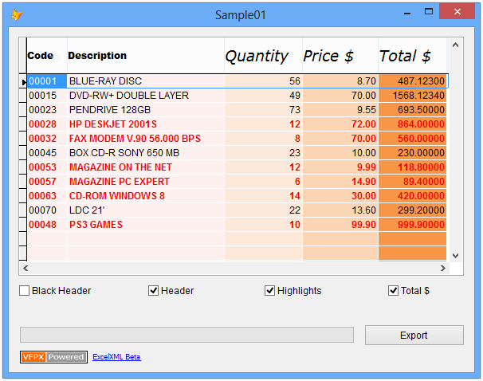
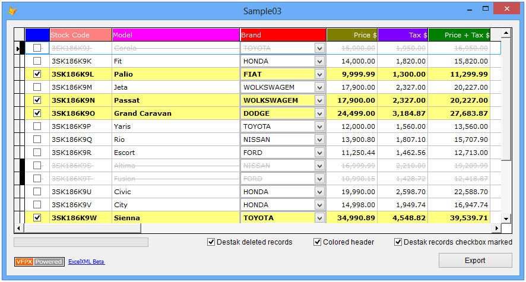
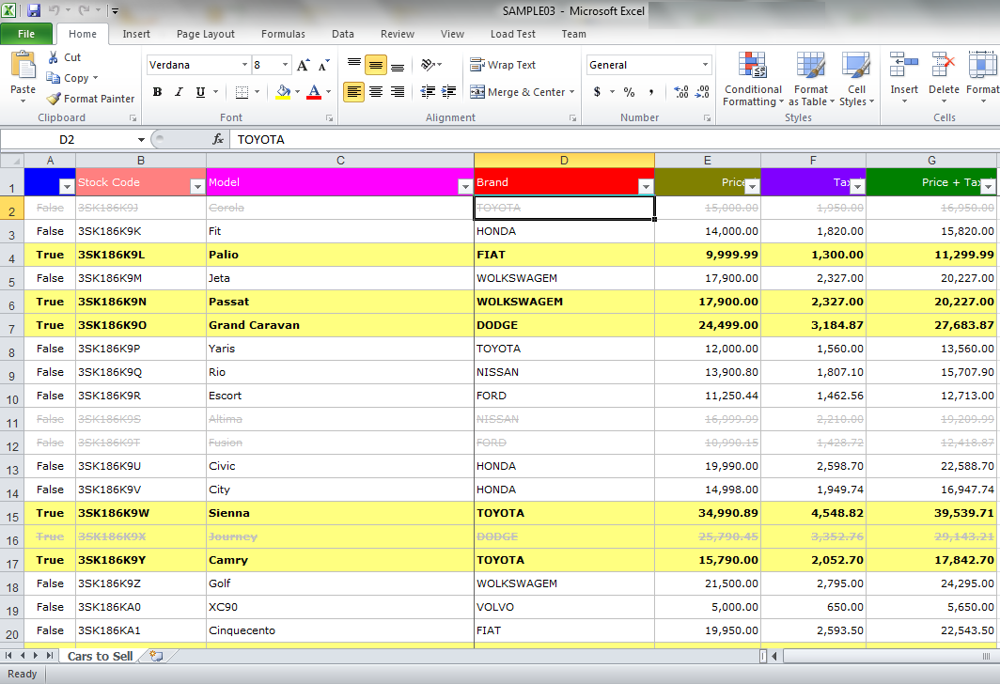
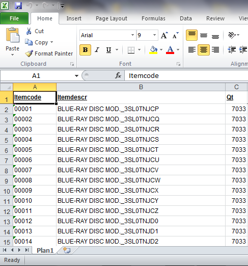

# ExcelXML
**Export a Table/Cursor/Alias or Grid control into a Microsoft Excel XML Spreadsheet file, or XLS/XLSX.**

Original author: Rodrigo Bruscain

The ExcelXML project brings to Visual FoxPro the ability to generate an Excel file from a grid or table/cursor/alias. When used with a grid, it attempts to export 99% of all visual caracteristics from the Grid. It can also export directly from a cursor/alias, without requiring a grid. 

This tool produces an Excel XML file using only VFP code to generate the XML markup. This file can be opened by Excel or other open source spreadsheet tools. It can also convert the XML file to an .XLS or .XLSX file, but requires Excel to do the conversion.

## NOTE:
[2017-09-03] Extracted original VCX to PRG to allow better updating of the source code by the VFP community on GitHib since it's a raw code file rather than a binary VCX. [by Matt Slay]

## Goals
* Excel files with over 65,535 rows.
* No limit size (it depends on the Operating System).
* Convert a Grid Control into a Excel XML file considering 99% of the visual characteristics.
* It is possible to use Grid Dynamics properties.
* Attempts to honor (export) all Grid visual properties.
* It is possible to convert a table/cursor/alias without requiring a Grid Control.
* Easy to implement and it is not necessary to change your code.
* Compatible with Microsoft Excel 2003 or higher.
* The files can be opened by OpenOffice reducing conversion errors.
* Open the file by Excel and save in other formats to reduce the size without losing information.
* It is not necessary to have Microsoft Excel installed.

**Release version 1.10 (2017-09-10)**  
Added new method:  ConvertXmlToXlsx(tcFilename, tnFileFormat, tlOpenAfterExporting)  
Added new properties for ColumnHeaderBackgroundColor and ColumnHeaderForeColor  
Added new property GridClass to use when creating a temporary form to create grid to host the cursor/alias during the export.  
FIX - Fixed bug in Bottom Border logic if cursor/grid only has 1 row of data.  

**Release version 1.09 (2017-09-03)**  
Added Try/Catch blocks to handle the various Dynamic properties which may not evaluate properly in some cases.

**Release version 1.08**  
NEW - Document author included as username or computername.  
FIX - Field Date and DateTime with the year lower than 1900 will be forced to 1900. This is necessary because the lower allowed year in a cell of Excel is 1900  
FIX - Automatic column width for fields type char bigger that 190 columns

**Release version 1.07**  
FIX - Data with the characters "<" or ">" are replaced for {""[" and "](_-and-_)""} in order to avoid data conflict during the conversion.
FIX - Alias error when the property   "RecordSourceType" in the Grid control is diferent than 1.  
FIX - Included samples with no progressbar in order to avoid the error ole 0x80040154. This error happens only in some machines that the ActiveX ProgressBar doesn't exists.

**Release version 1.06**  
FIX - SET COLLATE TO controled at run-time to avoid the error "Invalid Key Length"

**Release version 1.05**  
FIX - Column data type Date and DateTime when converted has wrong format.  
FIX - Column data type DateTime is not considered the time in current value field.

**Release version 1.04**  
FIX - Sheet name cannot exceed 31 characters  
FIX - Sheet name cannot contain any of the following characteres:  {" : \ / ? * "}  
FIX - Sheet name cannot be blank. If is blank, will be changed to "Sheet1"

**Release version 1.03**  
FIX - Field Date/Datetime with NULL or EMPTY value builds a Excel file incorrectly.  
FIX - Index error when the index tag is too big.

| Properties and Methods | Description |  
| -----------------------|-------------|
| Alias | Sets the cursor/alias name to export to an Excel XML file. This is used if the GridObject property is not set.|  
| ColumnCount | Returns the number of columns included in the Excel file.|  
| File | Inform the name of Excel file. If you don't inform the name with the extension, the XML extension will be included. The default file name is "Book1"|  
| GridObject | Identifies the Grid object to exported to an Excel XML file. RecordSource property on Grid should already be set.|
| HasFilter | .T. Includes the option Filter in all columns in the generated file.|
| LockHeader | .T. locks the header in the generated file. This option in Excel is called by Freeze Top Row.|
| OpenAfterSaving | .T. to open the file after saving it.|
| RowCount | Returns the number of rows included in the Excel file.|
| SetStyles | .T. to define that the Excel file will have the Grid visual characteristics transported.|
| SheetName | Excel sheet name. The default name is "Sheet1"|
| xmlEncoding | XML encoding type used to set the code that defines special characters. Default code is "iso-8859-1".|
| Version | Object that contains the information about this class.|
| About|About ExcelXML class|
| Progress|Method used to show the percentage processed.|
| Save|Creates the Excel XML file.|
| ConvertXmlToXlsx|Converts the created Excel XML file file to XLS or XLSX format using Excel.|

## Sample 01

## Sample 02

## Sample 03

## Sample 04 - No Grid control

